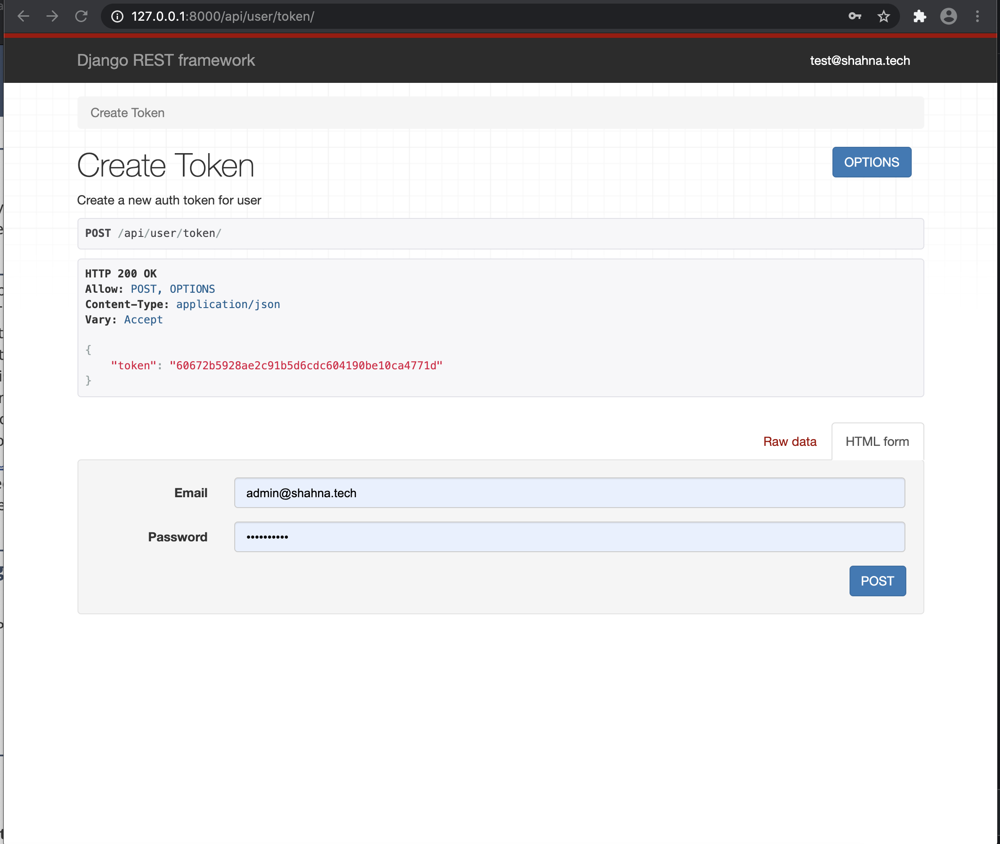
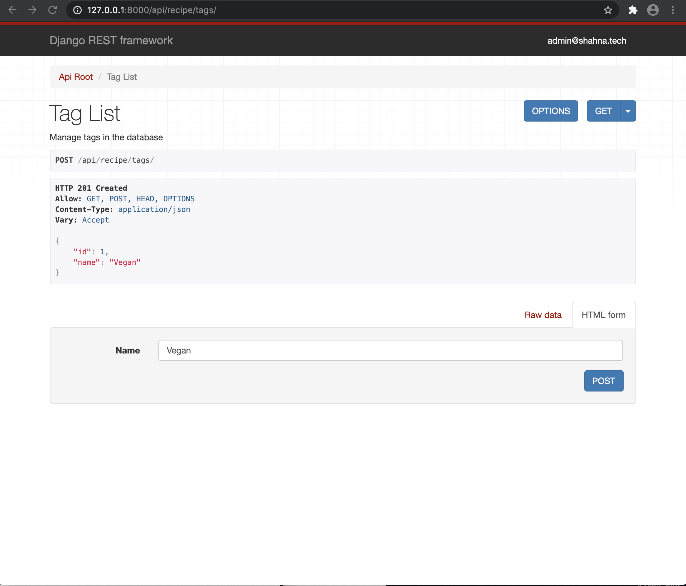

# recipe-app-api

<h2>HomeBaked</h2>

This REST API is the framework for a digital recipe box. It allows the users to create multiple recipies with links to websites, estimated cost to prepare and ingredients are pulled from a bank.

<h2>Features</h2>

Users are authenticated by utilizing the Django Admin Token Authentication.

Each recipe can be defined by a tag to catagorize recipe's by cusine, or dietary restrictions 

The first step for creating a recipe is to define the ingredients 

Once the recipe's necessary ingredients are 

Once the user has added the recipe .

Once the recipe is created, user can upload images to recipe.

<h2>Built With</h2>
  <ul>
    <li>PostgreSQL
    <li>Python
    <li>Django
    <li>Docker
    <li>Travis CI
    <li>Pillow
  </ul>

<h2>Authors</h2>

Shahna Campbell

<h2>Acknowledgments</h2>

Made possible by The Build a Backend REST API Advanced course on Udemy by Mark Winterbottom

