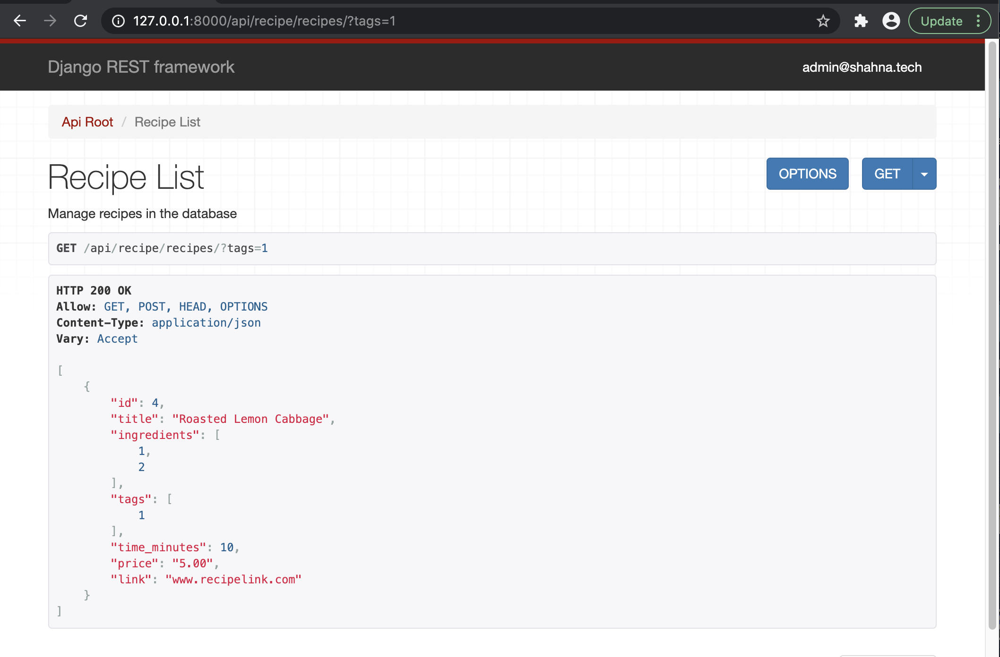
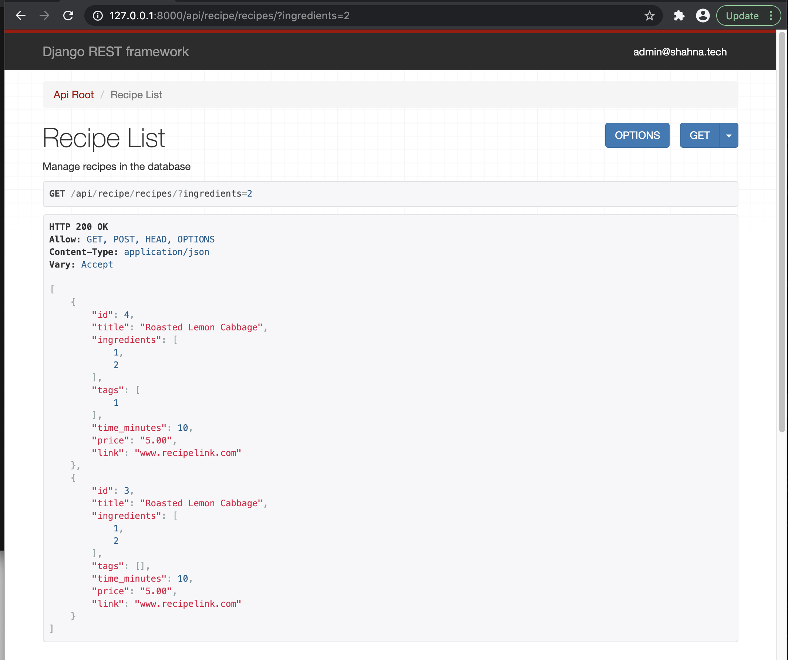
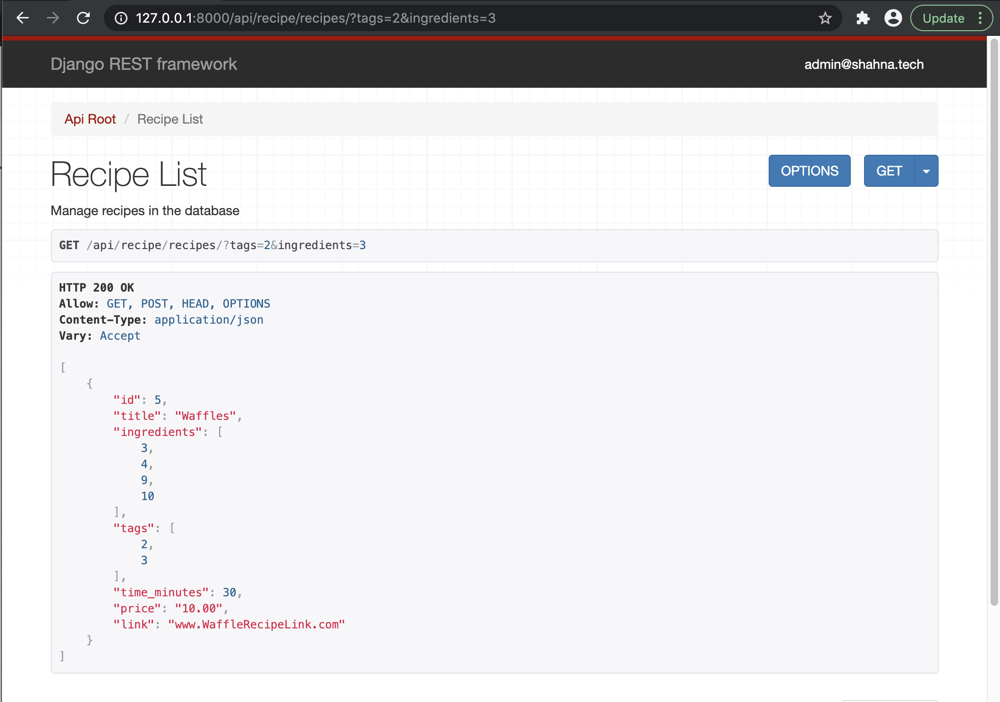

# recipe-app-api

<h2>HomeBaked</h2>

This REST API is the framework for a digital recipe box. It allows the users to create multiple recipies with links to websites, estimated cost to prepare, tags for categorization and a customizable bank of ingredients that a user can pull from.

<h2>Features</h2>

Users are authenticated by utilizing the Django Admin Token Authentication.

Each recipe can be defined by a tag to catagorize recipe's by cusine, or dietary restrictions. 

The first step for creating a recipe is to define the ingredients. The enpoint allows user to create a bank of ingredients to pull from when creating recipes 

Once the recipe's necessary ingredients are added then the user can compile the recipe and attach a link to the original recipe.

Once the recipe is created, users can upload images to the recipe.The upload form provides a link for the uploaded image.

Filtering was added to give users the ability to conveniently search recipes by ingredients or tags.

<h4>Find recipe by tag.</h4>

Find recipe by ingredient.

Find recipe by tag and ingredient.

<h2>Built With</h2>
  <ul>
    <li>PostgreSQL
    <li>Python
    <li>Django
    <li>Docker
    <li>Travis CI
    <li>Pillow
  </ul>

<h2>Authors</h2>

Shahna Campbell

<h2>Acknowledgments</h2>

Made possible by Build a Backend REST API Advanced course on Udemy by Mark Winterbottom

